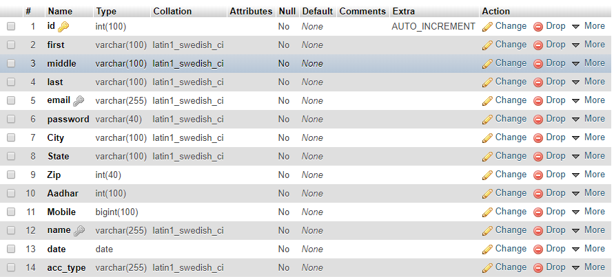
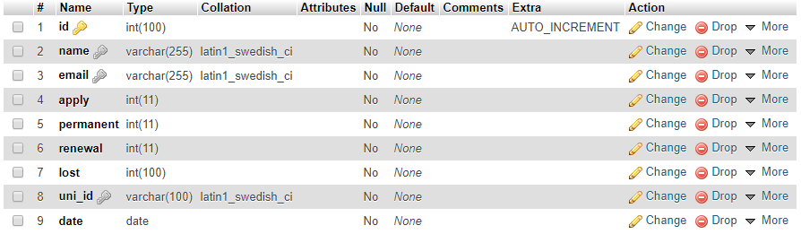
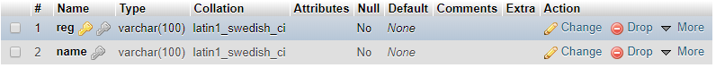

# Driving License Management System 
Project is made on Flask Framework and for database SQL is used
So ,Lets Start With The 
**SignIn Page**
.png)
**SignUp Page**
.png)
**User Dashboard**
.png)
**Admin Dashboard**
_LI.jpg)
Step1: 
Install flask by using the command:- 
pip install Flask 
Libraries Used flask_mysqldb ,flask,datetime,flask_login,uuid 
#(uuid is used to generate unique id) 
Commad to install flask_mysqldb:- 
#(pip install Flask-MySQLdb) 
Command to install uuid 
#(pip install uuid) 
Command to install Flask login: 
#(pip install Flask-Login) 

To set Up Datebase i used phpmyadmin Not because there was any use of php but because i needed MySQL 
To connect it the configuration is already present in (index.py) 
In phpmyadmin you need to create three table in (mydb) 
1.person 
2.users 
3.request 

**Schema For table person**

**Schema For table users**

**Schema For table request**

In case of any Trouble email me at corpojasltd@gmail.com 
If you Like it Do give it a star 
>............ 

